# Instacart E-Commerce Intelligence

Nền tảng phân tích hành vi khách hàng thương mại điện tử đầu-cuối (end-to-end) — kết hợp khám phá dữ liệu, xử lý Big Data bằng PySpark, phân cụm khách hàng (K-Means) và dự đoán mua lại (XGBoost), trình bày trên giao diện tương tác Streamlit.

## Mục lục

- [Tổng quan dự án](#tổng-quan-dự-án)
- [Demo Dashboard](#demo-dashboard)
- [Cấu trúc thư mục](#cấu-trúc-thư-mục)
- [Dữ liệu](#dữ-liệu)
- [Notebooks](#notebooks)
- [Streamlit Dashboard](#streamlit-dashboard)
- [Hướng dẫn cài đặt và khởi chạy](#hướng-dẫn-cài-đặt-và-khởi-chạy)
- [Công nghệ sử dụng](#công-nghệ-sử-dụng)

---

## Tổng quan dự án

Dự án sử dụng bộ dữ liệu [Instacart Market Basket Analysis](https://www.kaggle.com/c/instacart-market-basket-analysis) gồm hơn **3.4 triệu đơn hàng** từ **206,209 khách hàng** và **49,688 sản phẩm** để trả lời các câu hỏi kinh doanh:

- Thời điểm nào khách hàng mua sắm nhiều nhất?
- Sản phẩm nào được mua lại thường xuyên?
- Có thể dự đoán khách hàng sẽ mua lại sản phẩm nào không?
- Khách hàng có những nhóm hành vi nào khác biệt?

### Kết quả chính

| Mô hình | Mục tiêu | Kết quả |
|---|---|---|
| XGBClassifier | Dự đoán mua lại sản phẩm | ROC-AUC = **0.80**, F1 = **0.79** |
| K-Means (K=4) | Phân cụm khách hàng | 4 persona: Loyal Regulars, Occasional Weekday Shoppers, Weekend Explorers, Bulk Family Buyers |

---

## Demo Dashboard

### Trang chủ
Tổng quan dự án, KPI metrics và điều hướng đến các trang phân tích.

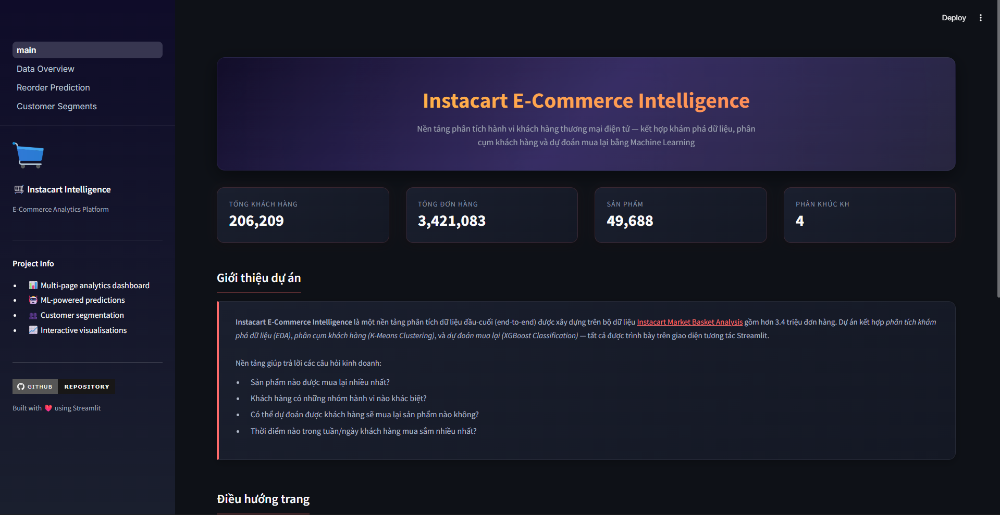
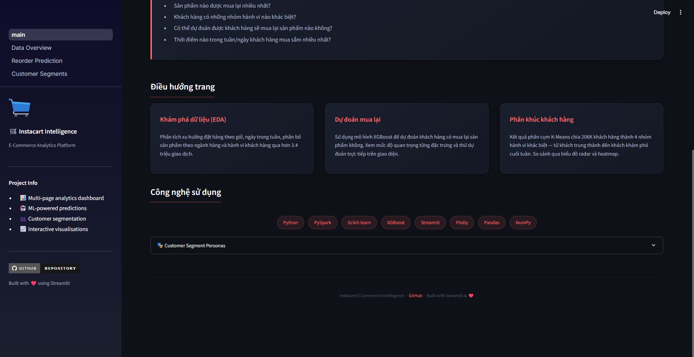

---

### Data Overview — Khám phá dữ liệu
Phân tích phân bố đơn hàng theo giờ, ngày, ngành hàng và hành vi khách hàng qua biểu đồ tương tác.

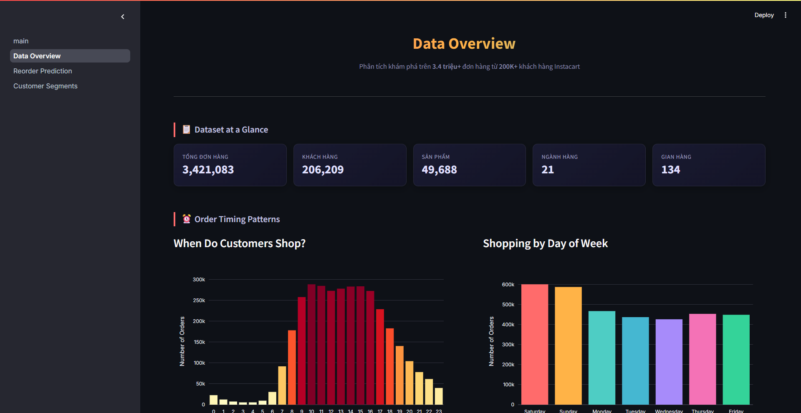
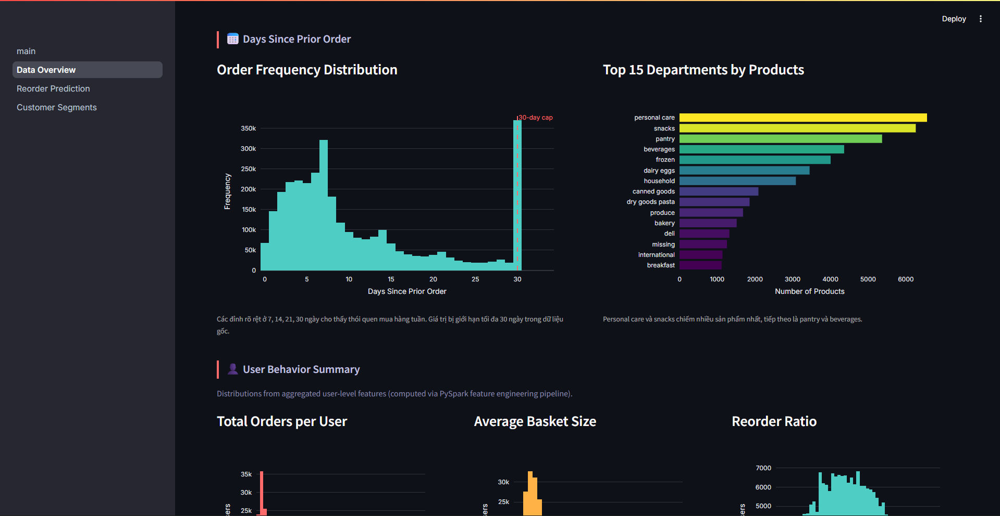
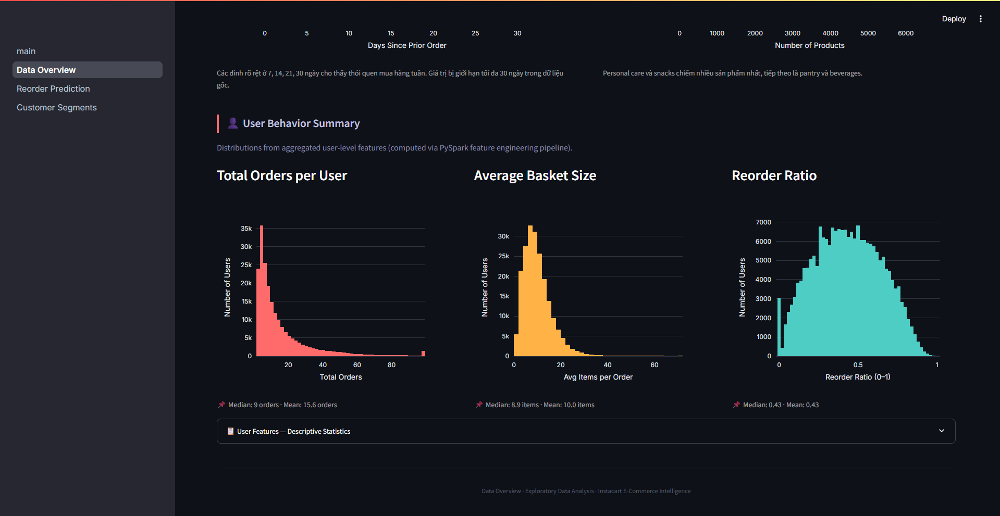

---

### Reorder Prediction — Dự đoán mua lại
Demo mô hình XGBoost: xem hiệu suất mô hình, feature importance, nhập thông số để dự đoán xác suất mua lại kèm giải thích chi tiết.

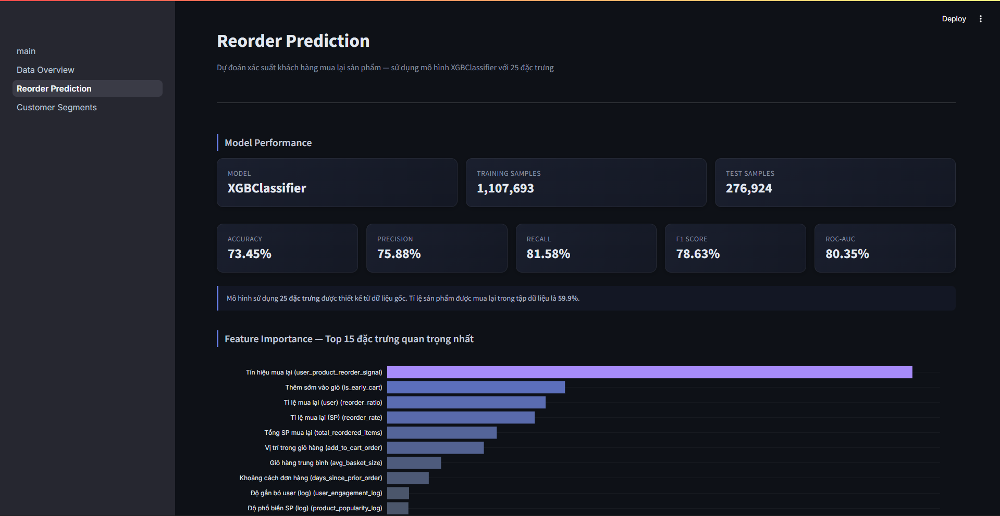
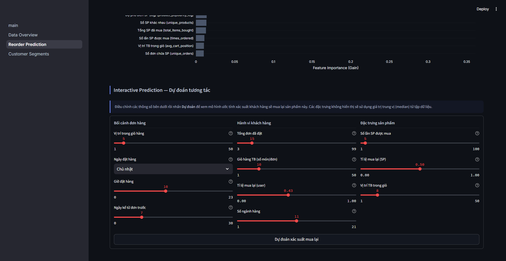
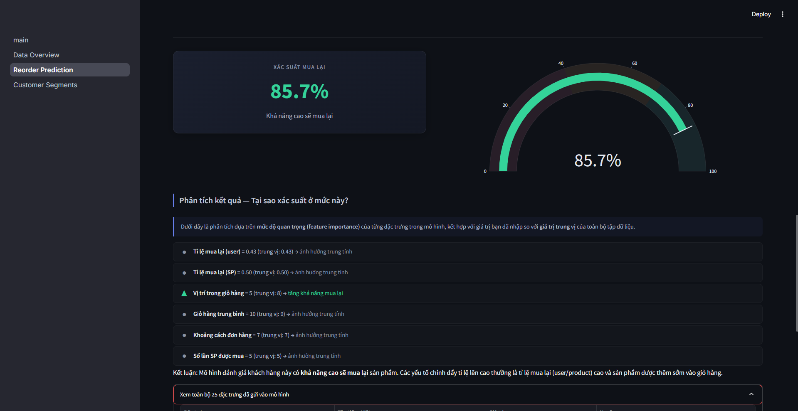
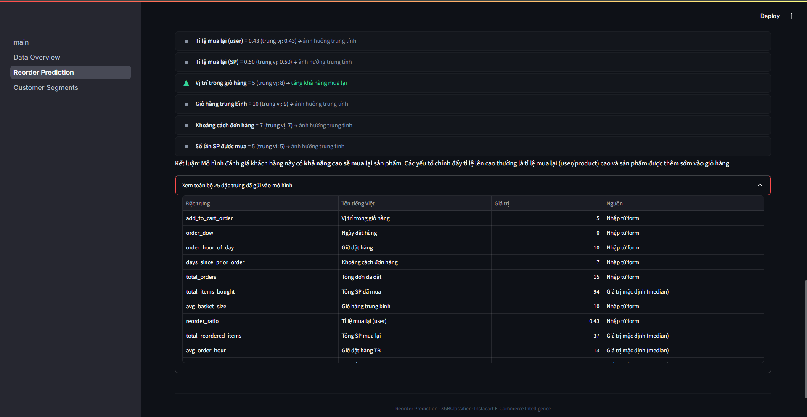

---

### Customer Segments — Phân cụm khách hàng
Kết quả phân cụm K-Means: phân bố persona, radar chart so sánh, heatmap cường độ đặc trưng, và công cụ phân loại tương tác.

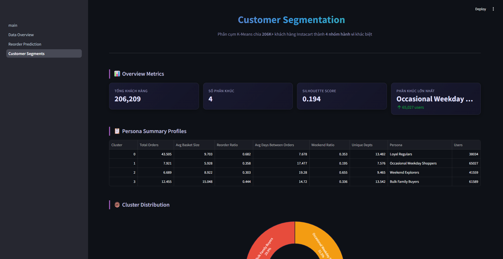
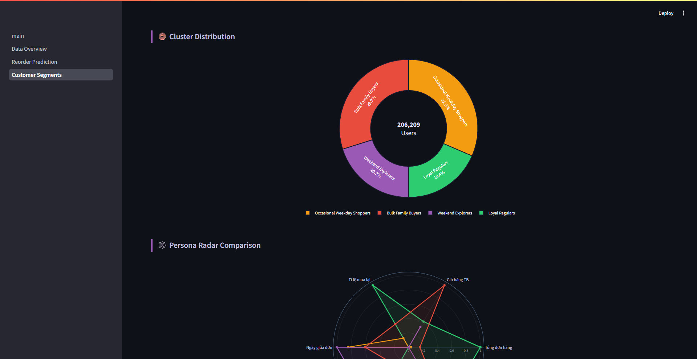
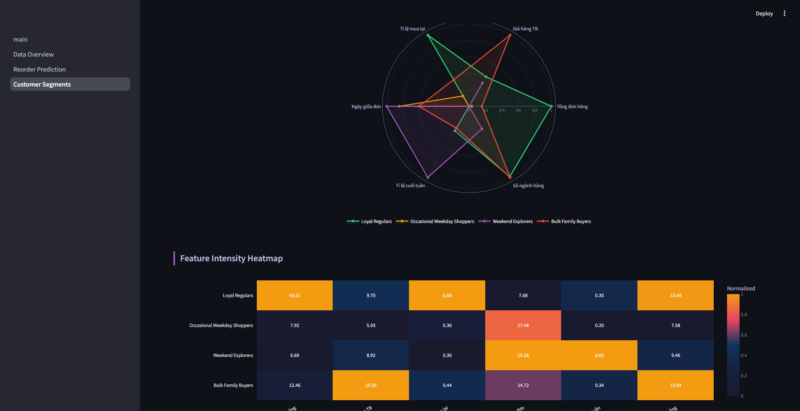
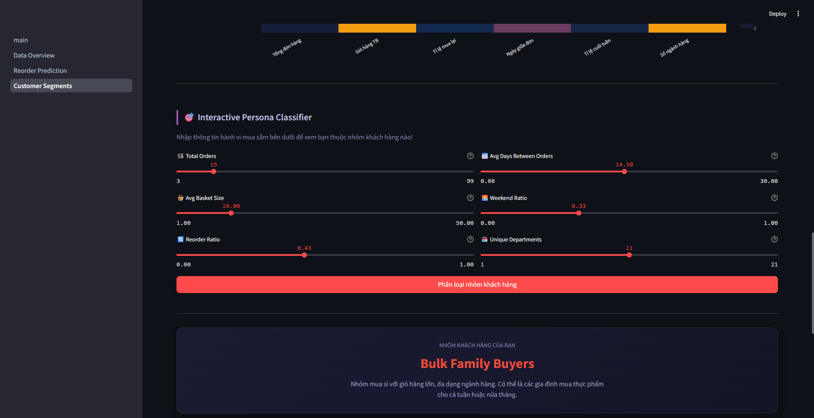
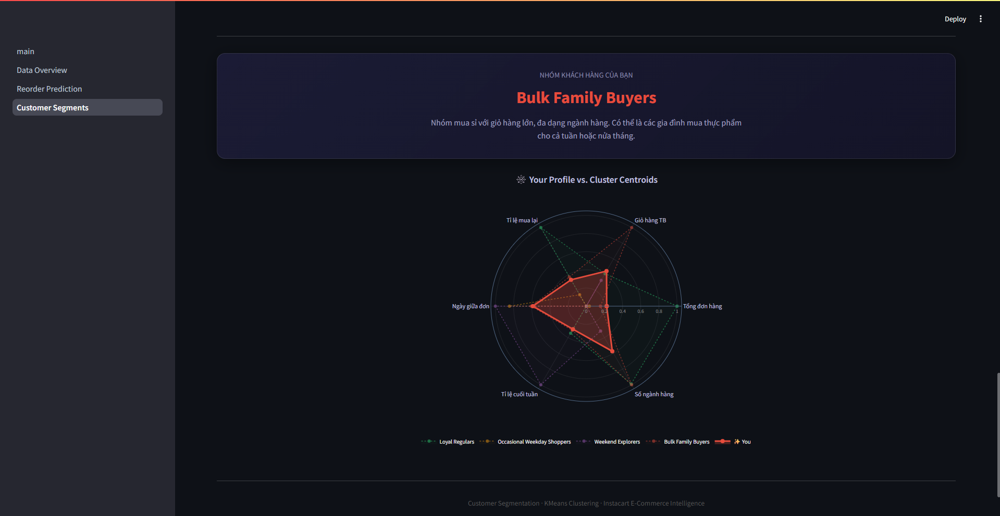

---

## Cấu trúc thư mục

```
instacart-ecommerce-intelligence/
├── .streamlit/
│   └── config.toml              # Cấu hình theme (dark mode)
├── app/
│   ├── main.py                  # Trang chủ Dashboard
│   └── pages/
│       ├── 1_Data_Overview.py   # Trang EDA — biểu đồ phân tích
│       ├── 2_Reorder_Prediction.py  # Trang dự đoán mua lại
│       └── 3_Customer_Segments.py   # Trang phân cụm khách hàng
├── data/
│   ├── raw/                     # Dữ liệu gốc từ Kaggle (không push lên GitHub)
│   └── processed/               # Dữ liệu đã xử lý (parquet)
├── docs/
│   └── screenshots/             # Ảnh chụp màn hình Dashboard
├── models/                      # Các file mô hình đã huấn luyện
│   ├── reorder_classifier.joblib    # Mô hình XGBoost dự đoán mua lại
│   ├── feature_columns.joblib       # Danh sách 25 đặc trưng
│   ├── model_metadata.json          # Metrics của mô hình classification
│   ├── kmeans_model.joblib          # Mô hình K-Means phân cụm
│   ├── scaler.joblib                # StandardScaler cho K-Means
│   ├── cluster_metadata.json        # Thông tin persona, metrics
│   └── cluster_profiles.csv         # Giá trị trung bình từng cluster
├── notebooks/
│   ├── 01_eda_pandas.ipynb
│   ├── 02_pyspark_processing.ipynb
│   ├── 03_benchmark_pandas_vs_spark.ipynb
│   ├── 04_ml_classification.ipynb
│   └── 05_ml_clustering.ipynb
├── requirements.txt
└── README.md
```

---

## Dữ liệu

Dữ liệu gốc từ cuộc thi Kaggle, gồm 6 file CSV:

| File | Mô tả | Kích thước |
|---|---|---|
| `orders.csv` | Thông tin đơn hàng (user, ngày, giờ) | 109 MB |
| `order_products__prior.csv` | Sản phẩm trong đơn hàng (prior set) | 577 MB |
| `order_products__train.csv` | Sản phẩm trong đơn hàng (train set) | 25 MB |
| `products.csv` | Danh sách sản phẩm | 2.2 MB |
| `aisles.csv` | Danh sách gian hàng | 2.6 KB |
| `departments.csv` | Danh sách ngành hàng | 270 B |

> **Lưu ý:** Các file CSV gốc quá lớn nên không push lên GitHub. Cần tải từ [Kaggle](https://www.kaggle.com/c/instacart-market-basket-analysis/data) và đặt vào `data/raw/`.

---

## Notebooks

Các notebook được chạy trên **Google Colab** theo thứ tự:

### Notebook 01 — EDA với Pandas
**File:** `01_eda_pandas.ipynb`

Phân tích khám phá dữ liệu (Exploratory Data Analysis) bằng Pandas:
- Phân bố đơn hàng theo giờ, ngày trong tuần
- Top sản phẩm/ngành hàng phổ biến nhất
- Phân tích hành vi mua lại (reorder)
- Thống kê mô tả các biến số

### Notebook 02 — Xử lý dữ liệu với PySpark
**File:** `02_pyspark_processing.ipynb`

Feature engineering trên quy mô lớn bằng PySpark:
- Tạo **user_features** (13 cột): tổng đơn hàng, giỏ hàng trung bình, tỉ lệ mua lại, tỉ lệ cuối tuần, ...
- Tạo **product_features** (10 cột): số lần được mua, tỉ lệ mua lại sản phẩm, ...
- Lưu kết quả dưới dạng Parquet

### Notebook 03 — Benchmark Pandas vs PySpark
**File:** `03_benchmark_pandas_vs_spark.ipynb`

So sánh hiệu năng giữa Pandas và PySpark trên cùng tác vụ:
- Thời gian load, groupby, join, tính toán features
- Biểu đồ so sánh trực quan
- Kết luận: PySpark nhanh hơn đáng kể trên dữ liệu lớn (>500MB)

### Notebook 04 — ML Classification (Dự đoán mua lại)
**File:** `04_ml_classification.ipynb`

Xây dựng mô hình dự đoán khách hàng có mua lại sản phẩm không:
- Feature engineering: 25 đặc trưng (user + product + order context)
- Mô hình: **XGBClassifier**
- Kết quả: Accuracy 73.5%, Precision 75.9%, Recall 81.6%, F1 78.6%, ROC-AUC **80.4%**
- Lưu model artifacts vào `models/`

### Notebook 05 — ML Clustering (Phân cụm khách hàng)
**File:** `05_ml_clustering.ipynb`

Phân cụm 206K khách hàng bằng K-Means:
- Chọn 6 đặc trưng độc lập (dựa trên Correlation Analysis)
- Chuẩn hóa bằng StandardScaler
- Tìm K tối ưu: Elbow Method + Silhouette Score → chọn **K=4**
- 4 Persona:
  - **Loyal Regulars** (18.4%) — mua thường xuyên, tỉ lệ mua lại cao
  - **Occasional Weekday Shoppers** (31.5%) — mua ít, giỏ hàng nhỏ, ngày thường
  - **Weekend Explorers** (20.2%) — mua cuối tuần, thích thử sản phẩm mới
  - **Bulk Family Buyers** (29.9%) — giỏ hàng lớn, đa dạng ngành hàng

---

## Streamlit Dashboard

Dashboard gồm 4 trang, giao diện dark mode chuyên nghiệp:

| Trang | Mô tả |
|---|---|
| **Trang chủ** | Tổng quan dự án, KPI metrics, điều hướng |
| **Data Overview** | Biểu đồ EDA tương tác (giờ, ngày, ngành hàng, hành vi user) |
| **Reorder Prediction** | Demo mô hình XGBoost — nhập thông số, xem xác suất mua lại kèm giải thích |
| **Customer Segments** | Radar chart, heatmap, donut chart — nhập hành vi để xem thuộc persona nào |

---

## Hướng dẫn cài đặt và khởi chạy

### Yêu cầu
- Python 3.10+
- Dữ liệu gốc từ Kaggle (đặt trong `data/raw/`)

### Bước 1: Clone repo
```bash
git clone https://github.com/PhamAnhQuoc-HTTT/instacart-ecommerce-intelligence.git
cd instacart-ecommerce-intelligence
```

### Bước 2: Tải dữ liệu
Tải 6 file CSV từ [Kaggle Instacart](https://www.kaggle.com/c/instacart-market-basket-analysis/data) và đặt vào thư mục `data/raw/`.

### Bước 3: Cài đặt thư viện
```bash
pip install -r requirements.txt
```

### Bước 4: Khởi chạy Dashboard
```bash
streamlit run app/main.py
```

Trình duyệt sẽ tự động mở tại `http://localhost:8501`.

### Chạy Notebooks
Các notebook được thiết kế để chạy trên **Google Colab** (có kết nối Google Drive). Mở từng file `.ipynb` trên Colab và chạy theo thứ tự 01 → 05.

---

## Công nghệ sử dụng

| Công nghệ | Vai trò |
|---|---|
| Python | Ngôn ngữ chính |
| PySpark | Xử lý dữ liệu lớn |
| Pandas / NumPy | Phân tích và xử lý dữ liệu |
| Scikit-learn | Feature engineering, K-Means, StandardScaler |
| XGBoost | Mô hình classification |
| Plotly | Biểu đồ tương tác trên Dashboard |
| Streamlit | Giao diện web Dashboard |
| Matplotlib / Seaborn | Biểu đồ trong Notebooks |
